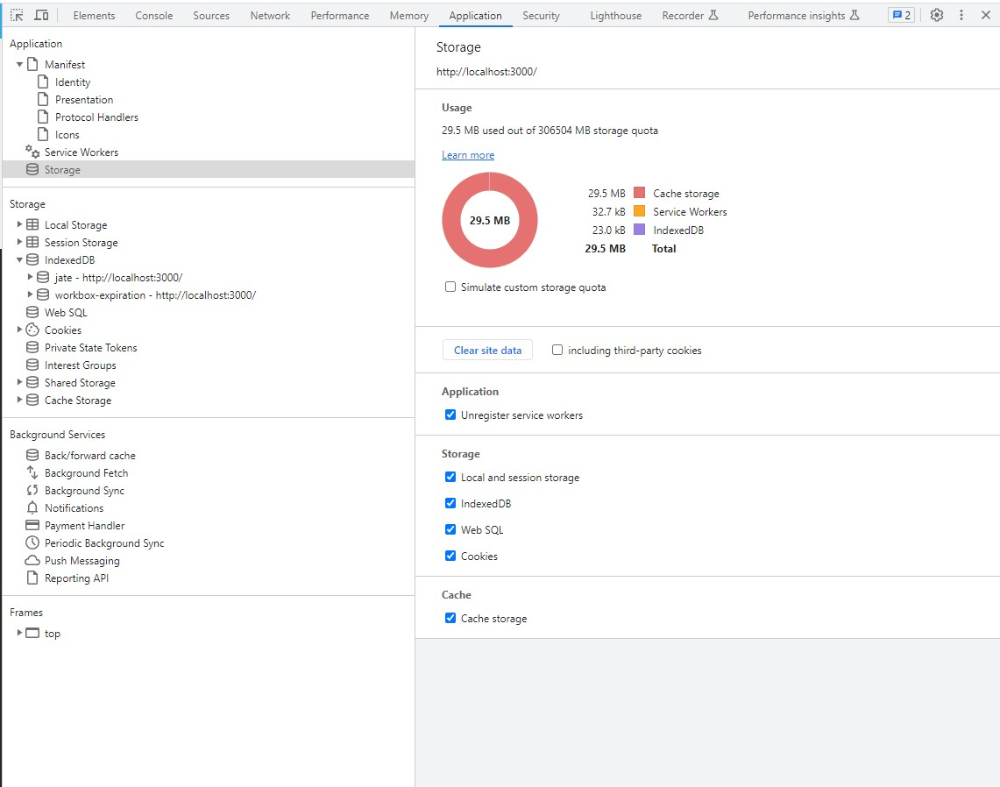

# MAUGB-M19C-Progressive-Web-Applications-Text-Editor
Text Editor using PAW- Progressive Web Applications 

## Description

This is a text editor single page application that runs in the browser, that it I intended to work in any platform with compliance with the browser, desktop or mobile application.
This application can be installed and works offline. 
Application has a data persistence, so the data is stored even if application is not running.
Data is stored in a an index DB database.

Create an application that uses Progressive Web Applications, so it can use web technologies to build a fast and flexible application that can run in any device.
This is the advantage of PWA that they do not depend on any specific technology and can use multiple tools to build, make more efficient and optimize the resources from the browser and device which is running.

This application uses standard web technologies that improve performance and user experience.

It is optimized to be fast, to work offline, able to be installed by users in their device in a secure way.
Application uses a service worker to allow user work offline.

Progressive web application uses instructions for the browser and are storage in the manifest. Json file that allow it to be installed by the user in a secure way using http secure transfer protocol.

## Table of Contents (Optional)

If your README is long, add a table of contents to make it easy for users to find what they need.

- [Installation](#installation)
- [Usage](#usage)
- [Credits](#credits)
- [License](#license)

## Installation

This Program can run using on the local terminal hoist location (local port)  3000 or it ca run thru a live browser , application has been deployed to Heroku.

` Link to Deployed application in Heroku `

  https://still-plains-73805-94f228ef1b5d.herokuapp.com/

This program runs under node.js 
Open application from integrated terminal 
Install modules 
Type npm install  - to install package.json  

then type npm start to run node server.js which will run the server, build, install 
    "start": "npm run build && cd server && node server.js",
    "server": "cd server node server.js --ignore client",
    "build": "cd client && npm run build",
    "install": "cd client && npm install",
    "client": "cd client && npm start",
    "heroku-prebuild": "npm install --dev"

- Open http://localhost:3000/     

- ` Or Go to Web browser and use the following link:  `
  https://still-plains-73805-94f228ef1b5d.herokuapp.com/
Click Install button on the upper left corner of the browser

## Usage

Provide instructions and examples for use. Include screenshots as needed.

To add a screenshot, create an `assets/images` folder in your repository and upload your screenshot to it. Then, using the relative file path, add it to your README using the following syntax:

- Application text editor running on browser, application deployed on Heroku using the link.

- npm i and npm start running the application on backend

- Text editor JAT input data on user terminal

- Manifest information on Development tools

- Service workers information on application

- Service workers vactive verification 

- Storage information

- IndexdedDB data from JATE application

- Cache data

- Icon on clocal device to run the application

## Credits

-	Generate license badge: https://shields.io/ .  
-	Use of NodeJS   16.16.0
-	Use of JavaScript
-	Use of express 4.17.1
-	Use of concurrently 5.2.0
-	Use of webpack 5.69.1
-	Service Workers
-	Create Manifest
-	IndexedDB
-	Heroku

## License

This program runs under the MIT license.
    MIT
    
  

## Features

-	Text editor on web application
-	Client folder structure
-	Application runs backend and serves the client.
-	Editor application is on the browser terminal.
-	Inspecting the document on Development tools, service worker, manifest, and html file
-	IndexedDB creates a database for data storage.
-	Information from text editor can be saved into the database.
-	Application can be installed on the device using the install button.
-	Application can be downloaded to local device, desktop, or mobile device.
-	Icon to run the application.
-	Registered service worker
-	Deployed on Heroku
-	Static assets to catch data after loading.
-	Routers created 

## How to Contribute

If you would like to contribute please send an e-mail to gomezb_mauricio@hotmail.com. 
Please share your GitHub repository name and your message.

## 	Contact

gomezb_mauricio@hotmail.com

https://github.com/MauricioGB1
